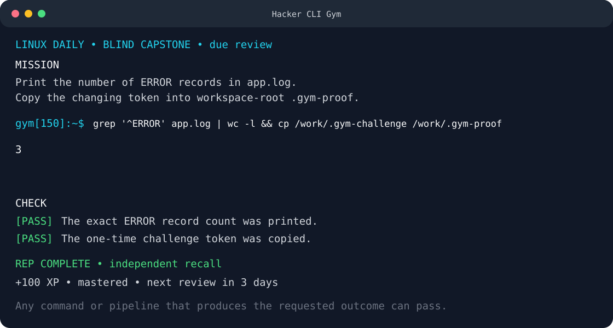

# Hacker CLI Gym

[](https://github.com/mikegropp/hacker-cli-gym/actions/workflows/tests.yml)
[](LICENSE)

Learn the command line by doing: 1,000 short exercises in real Bash and
PowerShell environments, with outcome-based grading and useful feedback.



- **Linux:** 100 common commands × 5 stages = 500 Bash exercises in a
  disposable Debian container.
- **Windows:** 100 PowerShell commands × 5 stages = 500 exercises in native
  Windows PowerShell.
- **Open-ended solutions:** use any command, pipeline, variable, loop, function,
  or multi-step approach that produces the requested result.
- **Real practice:** manipulate actual files, directories, processes, structured
  data, archives, permissions, and local networking fixtures.
- **Daily learning:** mix a new rep with due reviews, track mastery, and revisit
  skills on a spaced schedule.

## Start the Linux gym

Requirements: Git and a running Docker engine.

```console
git clone https://github.com/mikegropp/hacker-cli-gym.git
cd hacker-cli-gym
./gym
```

The launcher builds the training image on first use and automatically rebuilds
it when the Dockerfile, runner, Linux curriculum, or bundled sample files change. Progress lives in a
named Docker volume, while each rep recreates `/work` inside a disposable
container.

After a matching release is published, `./gym pull` can install the prebuilt
multi-architecture image from GitHub Container Registry. The launcher verifies
its source fingerprint against the checkout and directs you to `./gym build` if
they differ.

If startup fails, run `./gym doctor`. It checks the Docker CLI, active engine,
context, Buildx support, source fingerprint, image freshness, and progress
volume. On macOS it gives specific guidance when Docker Desktop or Colima is
installed but stopped.

You can also use Compose:

```console
docker compose run --build --rm gym
```

## Start the PowerShell gym

Requirements: Windows, Git, and Windows PowerShell 5.1.

```powershell
git clone https://github.com/mikegropp/hacker-cli-gym.git
Set-Location hacker-cli-gym
powershell.exe -NoLogo -NoProfile -ExecutionPolicy Bypass -File .\gym.ps1 start
```

The runner creates lesson files and progress beneath
`$env:LOCALAPPDATA\HackerCliGym`. Authored exercises avoid administrator access
and do not change real services, accounts, tasks, disks, or network settings.

Each lesson gets a dedicated persistent runspace, so variables, functions,
aliases, and location changes survive between submissions until the lesson is
reset. Parser-aware input accepts multiline pipelines, functions, loops, and
script blocks. `:shell` enters an ungraded exploration mode that shares the same
session; type `:return` to resume the mission.

The PowerShell prompt is intentionally real and unrestricted. Commands you
choose can affect Windows, so use a non-administrator shell and a VM when you
want the entire operating system to be disposable.

Only the gym workspace is cleared between reps. Cleanup treats junctions and
symbolic links as links and never follows them into outside directories.

## How learning works

Each command follows a practical progression:

| Stage | Goal |
|---:|---|
| 1 | Use the command for its normal everyday job |
| 2 | Apply a useful option or parameter |
| 3 | Select, filter, or inspect more precisely |
| 4 | Compose it with pipelines and other shell features |
| 5 | Complete a realistic workflow or blind transfer challenge |

Lessons name required prior concepts and explicitly introduce small inline
concepts when needed. Examples are annotated, hints progress from the underlying
idea to command structure to a near-complete approach, and the final reveal
shows one reference solution. The checker grades observable output and state,
not a character-for-character command.

Failed checks explain what differed—for example, an unexpected line, a missing
fragment, a wrong line count, or a file-state mismatch—without immediately
giving away the solution.

### Daily practice and mastery

Both tracks build a short daily queue (three reps by default) that prioritizes
skills introduced with help, due reviews, and then new work. Once everything
has been introduced, they select the earliest upcoming review. The optional
count can be 1–10.

A solution completed independently is **mastered**. Using a hint or the
reference solution marks it **introduced**, so it returns sooner for an
independent attempt. Reviews update mastery, review interval, due date, and
lapses. XP rewards independent recall more than assisted completion.

### Blind capstones

Selected Stage 5 reps hide the worked example and command recipe. They provide
an objective, a freshly generated challenge token, and the same outcome-based
grader. The token changes whenever the fixture is reset, so memorizing a fixed
answer cannot complete the capstone.

## Gym controls

Controls begin with a colon, leaving normal Bash and PowerShell input alone:

```text
:hint       reveal the next progressive hint, then the reference approach
:example    repeat the annotated example (hidden during blind review)
:files      list the current practice files
:samples    copy fresh open-ended files into ./samples (Linux)
:shell      enter persistent, ungraded command-line exploration
:reset      rebuild the starting fixture
:check      grade the most recent output and current state again
:lesson     repeat the mission
:status     show progress, mastery, reviews, XP, and level
:next       move to the next rep
:previous   move to the previous rep
:go TARGET  jump by number, command, or lesson ID
:help       show the in-session controls
:quit       leave the gym
```

On Linux, each graded submission runs in a fresh Bash process, so combine
stateful steps such as `cd`, variable assignments, and later commands in one
submission (for example with a newline or `&&`). `:shell` opens a persistent,
unwrapped interactive Bash subshell for free exploration. In PowerShell,
`:shell` opens ungraded exploration in the persistent lesson runspace; use
`:return` to resume grading.

## Launcher commands

Linux:

```console
./gym                              # next unfinished rep
./gym daily                        # 3-rep due-review/new-work queue
./gym review                       # blind review of the daily selection
./gym review linux-cut-5           # blind review of a specific rep
./gym run 151                      # run by global exercise number
./gym run cut                      # first unfinished cut stage
./gym run linux-cut-5              # run by exact lesson ID
./gym list                         # all Linux reps
./gym list --section text
./gym list --command cut
./gym list --unfinished
./gym list --due
./gym status
./gym progress export progress.json
./gym progress import progress.json
./gym progress export - > progress.json
./gym progress import - < progress.json
./gym progress reset --yes          # resets after preserving a backup
./gym test                         # validate and run all references
./gym build                        # force a fresh image build
./gym pull                         # install the matching prebuilt GHCR image
./gym doctor                       # diagnose Docker and image state
./gym version                      # project, image, and profile details
```

PowerShell:

```powershell
.\gym.ps1 start
.\gym.ps1 daily                     # 3-rep review/new queue
.\gym.ps1 daily 5                   # choose a 1–10 rep session
.\gym.ps1 review                    # blind review of the daily selection
.\gym.ps1 review Get-ChildItem      # blind review of a specific rep
.\gym.ps1 run 26
.\gym.ps1 run Get-ChildItem
.\gym.ps1 run powershell-get-childitem-5
.\gym.ps1 list
.\gym.ps1 list archive             # search IDs, commands, and titles
.\gym.ps1 list -Section pipeline
.\gym.ps1 list -Command Get-ChildItem
.\gym.ps1 list -Unfinished
.\gym.ps1 list -Due
.\gym.ps1 status
.\gym.ps1 progress export backup.json
.\gym.ps1 progress import backup.json
.\gym.ps1 progress reset CONFIRM
.\gym.ps1 doctor
.\gym.ps1 version
.\gym.ps1 test
```

PowerShell honors `NO_COLOR=1` and optionally clears before each lesson when
`HACKER_CLI_GYM_CLEAR=1`.

## Progress, profiles, and container limits

Progress uses a versioned JSON record, atomic writes, and automatic recovery
backups. Export it before moving machines or replacing a Docker volume:

```console
./gym progress export - > hacker-cli-gym-progress.json
./gym progress import - < hacker-cli-gym-progress.json
```

An import preserves the previous record. A corrupt record is also retained for
recovery instead of being silently overwritten. To intentionally start fresh,
run `./gym progress reset --yes`; the old record is backed up first.

Linux profiles keep separate progress volumes without duplicating the repo:

```console
HACKER_CLI_GYM_PROFILE=class-a ./gym
HACKER_CLI_GYM_PROFILE=personal ./gym status
```

Container resource limits are configurable when the defaults are not suitable:

```console
HACKER_CLI_GYM_MEMORY=1g HACKER_CLI_GYM_CPUS=3 HACKER_CLI_GYM_PIDS_LIMIT=768 ./gym
```

The defaults are 768 MiB of memory, 2 CPUs, and 512 processes. Advanced users
can also set `HACKER_CLI_GYM_IMAGE`, `HACKER_CLI_GYM_NAMESPACE`, or
`HACKER_CLI_GYM_VOLUME`; mirrors can override
`HACKER_CLI_GYM_PUBLISHED_IMAGE`.

## Command paths

The Linux path spans navigation, files, text processing, permissions,
processes, system inspection, archives, structured data, automation, and local
networking. It includes foundational workflow commands such as `source`,
`find`, and `jq`.

The PowerShell path spans discovery, providers, files, the object pipeline,
structured data, jobs, modules, system inventory, networking, policy, and safe
administration. Its job-control progression includes `Start-Job`, `Get-Job`,
and `Receive-Job`.

See [COMMANDS.md](COMMANDS.md) for both complete 100-command lists.

Every rep generates only the fixture it needs. The `sample-files/` directory
also provides synthetic logs, CSV/TSV and JSON data, configurations, scripts,
host lists, and project trees for open-ended practice.

Run `./gym samples` to copy a fresh set into `/work/samples` and open a raw
Bash session, or use `:samples` during a Linux rep. Because `/work` is
disposable, rerun the command whenever you want a clean copy.

## Architecture

- `./gym` is the Linux host launcher. It verifies Docker, fingerprints the
  runtime sources, builds through Buildx or a compatible fallback, and starts a
  restricted container with only its progress volume attached.
- `container/gym` is the Bash learning controller inside that image. Learner
  commands execute in the real shell against a freshly seeded `/work`.
- `gym.ps1` is the native Windows controller. Learner commands execute as real
  PowerShell against a workspace under the user's local application data.
- `curriculum/linux.json` and `curriculum/powershell.json` are generated lesson
  catalogs shared by the runners, validators, and CI.

## Portability and isolation

The Linux lab uses Debian and GNU utilities so every reference solution is
deterministic. Most featured commands and concepts transfer directly to other
GNU/Linux distributions; package locations, available utilities, and flags can
differ on BusyBox, BSD-derived systems, or minimal installations.

The container runs as root so ownership, permissions, processes, SSH, and
system utilities behave naturally. It mounts no repository, home directory,
Docker socket, or personal files. Its root filesystem is read-only; `/work` and
runtime temp paths are throwaway memory filesystems, and only the Linux
capabilities required by the curriculum are enabled. Networking is disabled;
HTTP and SSH lessons use loopback-only fixtures.

If a VM clock is incorrect and APT rejects a Debian `Release` file, synchronize
the clock and rebuild:

```console
sudo timedatectl set-ntp true
timedatectl status
./gym build
```

## Curriculum quality

Both generated catalogs conform to [curriculum/schema.json](curriculum/schema.json).
The validator enforces stable dimensions and IDs, three progressive hints,
annotated examples, prerequisite metadata, supported checks, specific feedback,
and strong assertions for missions that require exact output. CI regenerates
both catalogs, checks for drift, parses both runners, builds the Linux image,
and executes all 500 reference approaches on each platform.

See [CONTRIBUTING.md](CONTRIBUTING.md) to add or improve lessons.

## License

[MIT](LICENSE). Use it, fork it, teach with it, and contribute back.
